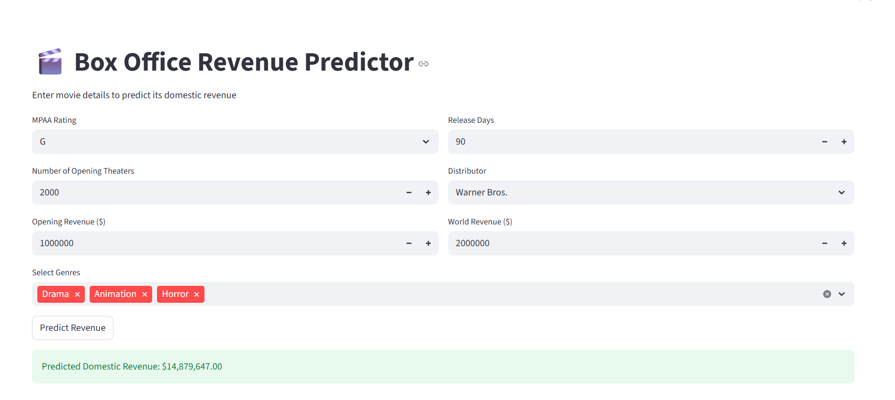

# Box Office Revenue Predictor 🎬

A machine learning web application that predicts movie domestic revenue based on various features like opening revenue, theater count, and genres.


## 📸 Screenshot



## 📌 Overview

This project uses XGBoost regression to predict movie box office revenue. The model is trained on historical movie data and deployed as a web application using Streamlit.

## 🚀 Features

- Predict domestic box office revenue
- Input various movie parameters:
  - MPAA Rating (G, PG, PG-13, R)
  - Opening Theater Count
  - Opening Weekend Revenue
  - Release Duration
  - Distributor
  - World Revenue
  - Movie Genres
- Real-time predictions with instant feedback
- Detailed input summary display
- User-friendly interface

## 🛠️ Technologies Used

- Python 3.8+
- Streamlit
- XGBoost
- Pandas
- NumPy
- Scikit-learn
- Joblib

## 📊 Model Details

The prediction model is built using XGBoost Regressor with the following features:
- MPAA Rating
- Opening Theater Count
- Opening Revenue
- Release Days
- World Revenue
- Distributor
- Genre Categories (Action, Animation, Comedy, Drama, Horror, Thriller)

## 💻 Installation

1. Clone the repository:
```bash
git clone https://github.com/yourusername/box-office-revenue-prediction.git
cd box-office-revenue-prediction
```

2. Create a virtual environment (optional but recommended):
```bash
python -m venv venv
venv\Scripts\activate  # Windows
```

3. Install required packages:
```bash
pip install -r requirements.txt
```

4. Run the application:
```bash
streamlit run app.py
```

## 📁 Project Structure

```
Box Office Revenue Prediction/
├── models/
│   ├── xgboost_model.pkl
│   ├── scaler.pkl
│   └── feature_names.pkl
├── notebook/
│   └── experiment.ipynb
├── app.py
├── requirements.txt
└── README.md
```

## 📝 Usage

1. Launch the application using `streamlit run app.py`
2. Enter the movie details in the input form
3. Click "Predict Revenue" to get the estimated domestic revenue
4. View the detailed input summary and prediction results

## 🔧 Model Training

The model was trained on historical movie data with the following steps:
1. Data preprocessing and cleaning
2. Feature engineering
3. Label encoding for categorical variables
4. Log transformation for numeric features
5. Model training and validation
6. Hyperparameter tuning

## 📈 Performance Metrics

- MAE (Mean Absolute Error)
- RMSE (Root Mean Square Error)
- R² Score

## 🤝 Contributing

Contributions are welcome! Please feel free to submit a Pull Request.

## 📄 License

This project is licensed under the MIT License - see the LICENSE file for details.

## 👥 Authors

- Your Name - Initial work

## 🙏 Acknowledgments

- Data source: [Add your data source]
- Inspired by [Add any inspirations]
- Thanks to [Add any acknowledgments]

## 📞 Contact

- Your Name
- Email: your.email@example.com
- Project Link: https://github.com/yourusername/box-office-revenue-prediction

---
⭐️ Star this repo if you find it useful!